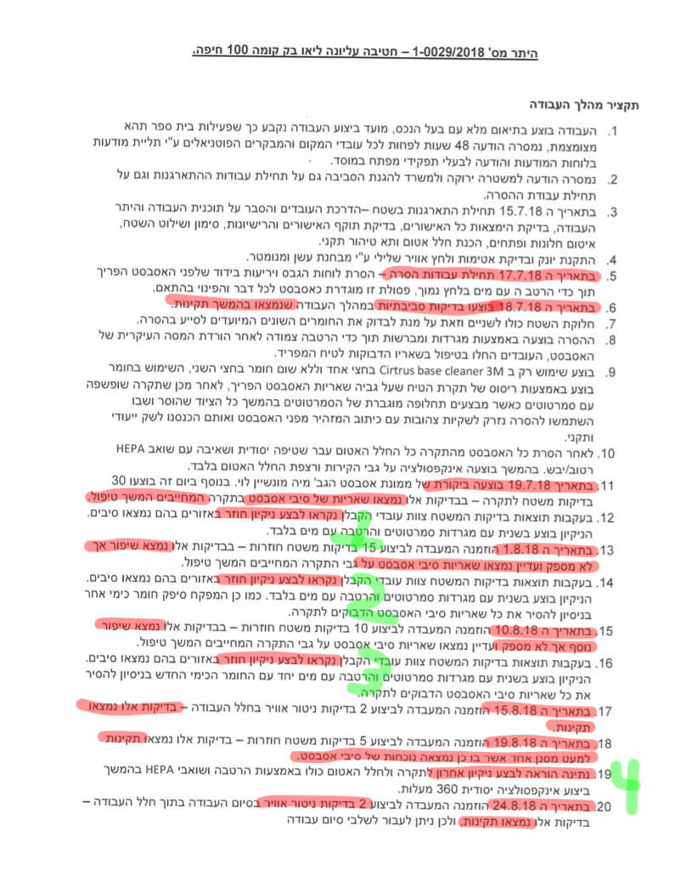

# תיכון ליאו בק בחיפה: פרויקט הסרת אזבסט

אמא יקרה, אבא יקר:

זה ארוך? כן, יקח לך 10 דקות לקרוא באופן מלא

**זה חשוב? מאד! מדובר בבריאות ובחיים של הילדים שלנו**

את האזבסט לא מריחים ולא רואים. המחלות אם חס וחלילה תגענה, זה עוד 10 או 20 שנה.
אבל הילדים יהיו אז צעירים - בשנות ה-30 או ה-40 מקסימום

אנא מכם: אל תתדחיקו!!

&nbsp;
&nbsp;

## מה הולכים לעשות?

עומדים לפרק אזבסט שנמצא בתקרות מבנה התיכון

## אז זה מצוין לא? מסירים סיכון גדול!

לא בדיוק ... על כך בהמשך

## אז למה עושים את זה בכל זאת?

יש חוק שמחייב הסרת אזבסט. החוק נתן 10 שנים לביצוע הפעולה - 10 השנים נגמרו בשנה שעברה

## אז בגלל החוק או בגלל שמסוכן ??

בגלל החוק. המצב הנוכחי אינו מסוכן - האזבסט אינו מתפורר מעצמו ואין חשיפות אליו

## בסדר, אבל בטח עדיף לסלק את האזבסט?

לא במקרה של ליאו בק! פה זה לא שכבת אזבסט שהותזה על משטח חלק וניתן לגרד ולהסיר. התקרות מכילות בלוקים עם נקבוביות אויר והאזבסט הותז על הבלוקים הללו. האזבסט הוא מעורבב בתוך הבלוקים. לא ניתן להוציא אותו בצורה בטוחה

## מאיפה כל המידע הזה?

היתה בדיקה מסודרת ומוסמכת על ידי שני מומחים. הנה עמוד הסיכום מהדו״ח שהוציאו:

(כל המסמכים המלאים זמינים בקישורים שבסוף עמוד זה)

## אז עוד פעם - מה השורה התחתונה?

* אין אפשרות טכנית להסיר את האזבסט בצורה בטוחה

* בארץ לא הסירו אזבסט מותז על איטונג - כמו מה שיש בליאו בק. בעולם אפילו לא מנסים לעשות דברים כאלו

* כל נסיון הסרה - בסכוי גבוה יסתיים בזיהום המבנה

* הפרקטיקה המקצועית המומלצת היא לתחזק את המצב הקיים עד להריסת המבנה עם סיום חייו

* ביום יום אין כל סיכון במצב הקיים - ישנן ביקורות שנתיות שמוכיחות במשך שנים שאין כל פיזור של האזבסט

## אז זאת בעיה רצינית, לא? הולכים לעשות משהו שבסכוי גבוה יזהם את המבנה

כן ...

## אבל המשרד לאיכות הסביבה בדק, אשר ... שמענו שהיה פיילוט מוצלח

זה סיפור בפני עצמו, כאן עיקר הבעיה. הפיילוט לא מייצג את מה שיקרה בפרויקט המלא - זאת נקודה ראשונה.

הפיילוט לא היה מוצלח - זאת נקודה שניה.

## פירוט בבקשה ....

לגבי זה שהפיילוט לא מייצג:

דבר ראשון הסתבר שהאזבסט שהסירו היה מותז על שכבת טייח חלקה - כלומר בכלל לא התמודדו עם הבעיה של בלוקים איטונג שקיימת ברוב המבנה

דבר שני - מראש בחרו חדר קטן שניתן לאטום היטב וכך להבטיח שלא יתפזר זיהום החוצה

בפרויקט המלא מדובר גם במסדרונות - אי אפשר לאטום ככה

הנה הדברים כתובים ע״י אשת איכות הסביבה:

&nbsp;

&nbsp;

שימו לב שהיא כותבת - בגלל שזה טייח חלק זה לא יהיה מורכב ״באופן חריג״. כלומר גם היא מבינה שיש פה משהו חריג ומורכב

(המסמך המקורי מובא בקישור למטה)

## אז מה, תכננו מראש משהו לא מייצג??

לא! דווקא בתכנון הפיילוט חשבו באמת שיתקלו בבעיה של בלוקים עם נקבוביות: הנה התייחסות מפורשת לכך:
במסמך ממרץ 2018

&nbsp;

&nbsp;

כלומר הם ציפו לפגוש את האיטונג - אך כפי שראינו לעיל, במהלך הביצוע הסתבר שהכל יותר פשוט והאזבסט הותז על שכבת טייח חלקה,

שימו לב לעוד נקודה שמודגשת: ההתייחסות היא כאל משהו חדש ולא סטנדרטי: ינסו עוד שתי שיטות ...

**האם בית ספר זה המקום לנסות עבודות הסרה מסוג חדש ושיטות עבודה חדשות??**

 נראה עתה למרות שזה היה יותר פשוט - גם פיילוט קטן זה הסתבך והתארך:

## חוץ מזה שהפיילוט לא מייצג את מה שיידרש בפרויקט - למה הוא לא היה מוצלח ??

על שטח קטן של 24 מ״ר - עם פוקוס של כולם ורצון להוכיח שניתן להסיר את האזבסט - היה צריך 4 פעמים להחזיר את הפועלים לנקות ולהסיר יותר טוב

כלומר: 4 פעמים !!! הקבלן אמר גמרתי - בואו תבדקו - וכל פעם מצאו עוד זיהום

אם זאת נקראת הצלחה ...

&nbsp;

&nbsp;

רק להזכיר שכמה שבועות לפני הסאגה הזאת של 4 פעמים לחזור ולנקות - ההערכה היתה ״צפוי שהעבודה תתבצע באופן שלא יהיה מורכב באופן חריג״

אז אם זה מה שקורה במקום שקל להסרה - מה יקרה במסדרונות בית הספר?

(המסמך המקורי מובא בקישור למטה)

## אז איך המשרד לאיכות הסביבה בכל זאת מאשר את העבודה?

במאי שנה שעברה הם הוציאו מסמך שמסביר שאזבסט מסוכן - החוק מחייב - ומבחינתם אין בעיה לעשות את הפרויקט.

למה אין בעיה?

דבר ראשון כי ״הם דוחים את המסקנות״ של הדו״ח ואף מטילים ספק במקצועיות של כותבי הדו״ח

דבר שני - הפיילוט היה מוצלח!

הנה הדברים כפי שהם כתבו:

&nbsp;

&nbsp;

״דוחים את המסקנות״ ללא נימוקים, ללא מומחה שחותם על דו״ח הנדסי, ששם את שמו ויוקרתו המקצועית להסביר למה המומחים האחרים טעו - זה חסר משמעות!

אם אגף האזבסט מטיל כזה ספק בדו״ח - האם הם שללו את הרשיון של כותבי הדו״ח?

לא רק שלא שללו - המפקח מר עמית גלקין שחתום על הדו״ח אמור היה לפקח על כל הפרויקט - עד שהיה רעש והוחלט להחליפו

לגבי קביעתם שזאת הצלחה - נזכור שזה על שטח קטן, לא מייצג, וגם שם היה צריך לחזור על העבודה לא פעם נוספת אלא 4 פעמים
נוספות

## כלומר ?

כל אחד יחשוב לעצמו אם הוא סומך על קביעה מנהלית של מישהו במשרד לאיכות הסביבה בסגנון ״המסקנות של הדוח לא מקובלות עלינו״, או שהוא סומך על דוח המומחים, שתואם את ההגיון (איך תפריד אזבסט שהותז על בלוק איטונג) ןגם תואם את הפרקטיקות במקובלות בעולם

## אבל אם עושים את הפרויקט ובסוף יש בדיקה שמראה שהאויר נקי?

הבדיקה נעשית בסופו של דבר על ידי בן אדם. זה מאד סובייקטיבי ותלוי איפה הוא דוגם, איך הוא לוקח דגימות של אויר וממשטחים

להערכתנו לא ניתן לסמוך על הבדיקה.

צריך לדמיין את הלחץ שיופעל על מי שיבצע את הבדיקות: ״שנת הלימודים כבר התחילה״, ״התלמידים בזום ומשתגעים״, ״כבר חזרנו 3 פעמים על הניקוי - מה עוד אתה רוצה?״ וכדומה ...

שלא לדבר שלא ניתן לאטום את המסדרונות כמו שאטמו את החדר הקטן בפיילוט - וזיהום יצא גם מחוץ לאיזור הנדגם

יש סיבה שהפתרון המקצועי המומלץ והפרקטיקה בעולם היא לתחזק ולא לנסות בכלל להסיר

ולא דברנו על מה יהיה אם הבדיקה תראה שיש אזבסט

## מה באמת יקרה אז?

כל עיכוב או כל בעיה שתתגלה - אין לבית ספר פתרון!!!

## מה המשמעות?

אין ולא יהיו מבנים חלופיים לתלמידי התיכון!!

אם היה מבנה חלופי לא היה צריך לפנות את החטיבה החל מפסח כפי שתוכנן, על מנת לאכלס את תלמידי התיכון בה

ולאן ילכו תלמידי החטיבה?

התכנית היא לימודים בזום!!!

## אז זה מה שגם יהיה אם יהיה עיכוב או תסבוכת??

בדיוק: אם לא ניתן יהיה לחזור למבנה התיכון באחד בספטמבר - המשמעות היא שהתלמידים יילמדו שבועות או חודשים בזום

## למה גם עכשיו פתאום יש דחיה?

לפי שמועות חסרים 2 מיליון שקלים. תמחרו לפני כמה שנים ומאז המחירים עלו

## אז מה השורה התחתונה??

למשרד לאיכות הסביבה הטענה שלנו היא שהם מאשרים פרויקט שיסתיים בזיהום ודאי - בניגוד להמלצת המומחים, בניגוד להגיון הפשוט, ובניגוד לנסיון מהעולם.

האישור שלהם מתבסס על קביעה ״פיקודית״ - ״דוחים את המסקנות״ . ועל פיילוט שגם לא התמודד עם הבעיה וגם היה כשלון.

למעשה הפיילוט רק הראה כמה קשה לדעת האם השטח באמת נקי, וכמה קל לחשוב שהוא נקי כשפועל הוא עדיין מזוהם (4 פעמים חשבו שגמרו והסתבר שנותר זיהום)!

וזה היה במקום קטן עם אזבסט שהותז על משטח חלק - לא כמו מה שיהיה בפרויקט הגדול

&nbsp;
&nbsp;

להנהלת בית הספר הטענה שלנו היא שהם ״זורמים עם זה״.

ואין להם שום מענה או פתרון אם הפרויקט לא יסתיים עד אחד בספטמבר או יסתבך או ייכשל

וזה סביר מאד שזה מה שיקרה ...

&nbsp;
&nbsp;

הטיעון שזה החוק ואין ברירה לא רלבנטי: תמיד יש החרגות ושיקול דעת באכיפה

## מה צריך לעשות??

כל אמא וכל אבא צריכים להבין שיבקשו מהם להכניס את הבן או הבת למבנה שבודאות עדיין מזוהם באזבסט שניסו לגרד מבלוקים אווריריים שהאזבסט מעורבב בהם.

יסתמכו על בדיקות שמאד תלויות באיפה דוגמים וכמה ואיך.

יהיה לחץ אטומי לאשר את האכלוס של המבנה כי אין שום פתרון אחר למאות או אלפי התלמידים!

והכי חשוב - כל זה בניגוד להמלצות כתובות וחתומות על ידי שני מומחים שאומרים שאסור לעשות זאת בשום אופן, ולא עושים את זה בשום מקום בעולם!

וההנמקה להתעלם מההמלצה של המומחים היא ״היה פיילוט מוצלח״ - כאשר המסמכים של המשרד עצמו מודים שהפיילוט לא בחן בכלל הסרה של אזבסט מותז על בלוקים,
ומעבר לכך הסתבך והתארך הרבה מעבר לצפוי (ועוד של שטח קטן וקל לביצוע.
  )

אז כל אבא וכל אמא צריכים לחשוב אם לסמוך על כל המערכת הזאת ולשלוח את הילדים למבנה אחרי שיגידו שהוא נקי.

## לסיום

כתבנו את על זה כדי לחשוף את מלוא התמונה והעובדות בפני כל אמא ואבא שיש להם ילדים בליאו בק.

האישור של המשרד לאיכות הסביבה ניתן על סמך החלטה מנהלית ולא הנדסית.
גם הגדרתם את הפיילוט כהצלחה ואת ביצוע הפרויקט כמשהו ישים ובטוח הן שתי הגדרות שרירותיות שאינן מבוססות על עובדות ועל מומחים שחותמים בשמם שזה אכן כך.

ההמלצות, העובדות וההגיון מדברים בעד עצמם ובקול ברור וחד משמעי:

## המסמכים המלאים

[דו״ח המומחים מקיץ 2017](https://github.com/Leo-Baeck-parent/you-should-know/blob/main/asbestos_report_2017.pdf)

[מסמך ממרץ 2018 - מראה שזאת  עבודה מסוג חדש ותכננו לבדוק שיטות ניקוי חדשות](pre-pilot-plan.pdf)

[מסמך מ-25 ביולי 2018 שמראה שהפיילוט לא מייצג](https://github.com/Leo-Baeck-parent/you-should-know/blob/main/inspection-report-July-25-1-0029-2018.pdf)

[סיכום הפיילוט מאוגוסט 2018 - מראה כמה פעמים חשבו שנקי ולא היה נקי](https://github.com/Leo-Baeck-parent/you-should-know/blob/main/work-summary-HEYTER-1-0029-2018.pdf)

[מסמך איכות הסביבה מאי 2021 - קורא לפיילוט הצלחה והבסיס לזה שהם חושבים שהמומחים טעו](https://github.com/Leo-Baeck-parent/you-should-know/blob/main/memshala-26-5-2021.pdf)

